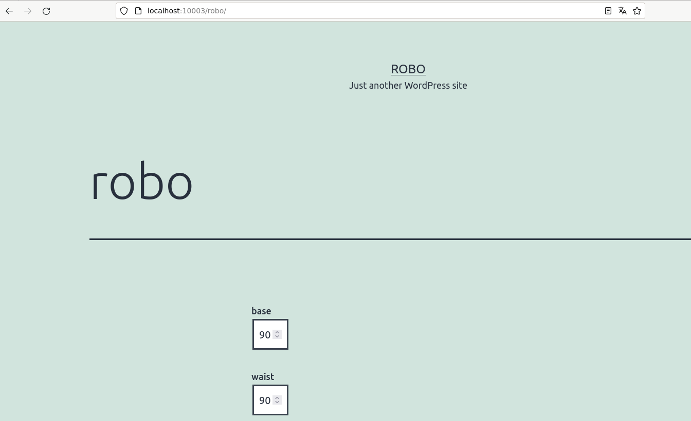

# MEU README

Pré requisitos:
- Computador com Arduíno configurado e conectado na porta serial
- Python3
- No mesmo computador, instalar e configurar o middleware deste repositório
- Impressão 3D do modelo disponível em: [link](http://teste.com)
- Instalação WordPress (WP) com REST API habilitado
- Instalação do Plugin `braco-robotico` disponível neste repositório 

## Braco-robotico

0. Altere a linha 157 do arquivo `braco-robotico/braco-robotico.php`, subtituindo `http://robo.local:10003` pela url do seu WP
  
1. Crie um arquivo `braco-robotico.zip` com os arquivos do diretório `braco-robotico`, exemplo:
```
zip -r braco-robotico.zip braco-robotico/
```
2. Instale o Plugin na sua instalação WP seguindo os passos em https://learn.wordpress.org/lesson-plan/choosing-and-installing-plugins/ no subtítulo `Installing a Plugin via External Zip File`

3. Acesse o WP, crie uma nova página chamada robo e nesta página adicione o shortcode braco

4. Acesse o link do WP `http://<link da sua página>/robo` Será carregada uma página similar a imagem a seguir



## Threejs 

0. Copie o diretório `threejs` para a raiz da instalação do seu WP

1. Acesse o modelo utilizando o link `http://<link da sua página>/threejs/` 

## Middleware

0. Instale a Biblioteca `requests` do Python

1. Na linha 6 do arquivo `middleware/main.py` substitua `http://robo.local:10003` pela URL da sua instalação WP

2. Na linha 7 substitua `/dev/ttyUSB0` pela porta serial em qual o Arduíno está conectado

3. Execute o arquivo com o comando `python3 main.py`
